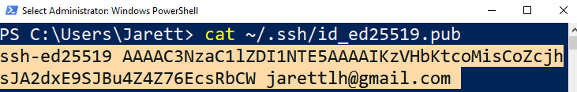
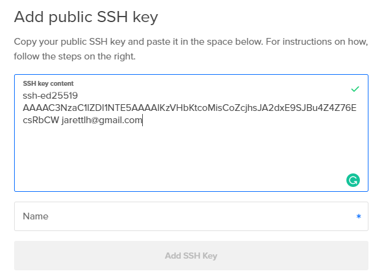
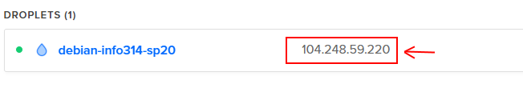

# Lab 1 - Core Technical Skills

[Lab 1 Assignment page on Canvas](https://canvas.uw.edu/courses/1373089/assignments/5369614)

# Overview

In this lab you will be introduced to working with a headless Linux server. The work you do in this lab will be extremely helpful in becoming more comfortable with your Raspberry Pi.

We will walk you through all of the required steps in lab, but all the required steps are also in this webpage.

# Before you start

## Everyone

Confirm that you have created a DigitalOcean account, and that on the top right of the website it says you have $100.00 of credits. This will allow you to create virtual machine “Droplets” on DigitalOcean without incurring any direct cost.

In addition to the email we sent on Sunday, instructions to complete this task can be found in [here](/resources/digital-ocean.md).

## Windows

Determine which build of Windows 10 they have installed by running 

`Get-ComputerInfo -Property WindowsVersion`

in PowerShell.

The minimum version of Windows 10 required for this course is 1809, but you may proceed with this lab as long as you are running 1803.

For any prior version of Windows (older than 1803), please install Git for Windows from <https://gitforwindows.org/> and use the Git Bash environment to complete the following set of exercises instead of PowerShell.

# Create SSH client keys

To use the DigitalOcean server we will soon create, you'll need a way to authenticate yourself and login to your server. While you might think a password will suffice, we will be using a more secure method of authentication through SSH keys.

SSH stands for 'Secure Shell'. A 'shell' is a command line interface, such as the one's you've seen in Terminal, PowerShell, or Git Bash. Throughout this course, you'll be using the shell, remotely, to configure Linux. SSH makes the shell 'secure' by create a pair of keys that you use to authenticate yourself to a remote shell. These 'keys' are simply long strings of characters that are tied together with some complex mathematics.

We will use a program called `ssh-keygen` to create this pair of keys. 

`ssh-keygen` will generate a **private** key, and a **public** key. Your **public** key can be given out, to say, DigitalOcean, while your **private** key remains only on your computer. 

In short, SSH works as follows in our scenario:

1. Your computer connects to the DigitalOcean-hosted server via a remote shell

2. The DigitalOcean-hosted server encrypts a file with your **public** key (sort of like creating a hash for it) and sends the encrypted file to you. 

3. Only your **private** key will be able to decrypt the file (sort of like getting back the original data that wash hashed). Your computer uses your **private** key to decrypt the file, then sends back the decrypted file to the server. 

4. You have now proved that you have the **private** key that matched the **public** key.

  

**To create your SSH keypair, use `ssh-keygen` as follows:**

1. With either Terminal (for Mac) or PowerShell/Git Bash (for Windows) run the following command with your own email address:  
`ssh-keygen -t ed25519 -C <YOUR@EMAIL>`
2. You will be prompted for a file name for the private SSH key. Accept the default by pressing the Enter key.
3. You will be prompted for a passphrase. This is important as it is used to protect your private SSH key. Make it something strong, like you would a password, and commit it to memory or write it down somewhere.
4. If you are prompted to overwrite anything, type `n` and press the Enter key

***(OPTIONAL STEP)*** To avoid having to enter the passphrase every time you use your private key, set up *ssh-agent* as describe [in this tutorial](/resources/ssh-agent.md).

# Create a Debian 9 Server on DigitalOcean

Log into your DigitalOcean account, go to the 'Droplet' tab on the left, and click 'Create Droplet'. Then set the Droplet up based on the following parameters:

| **Image**          | Debian 9.12 x64        |
| ------------------ | ---------------------- |
| **Plan**           | Starter / $5 per month |
| **Authentication** | SSH keys               |

Right under the 'SSH keys' option in the 'Authentication' section, you'll see a button that says 'New SSH Key'. Press it, and you'll be prompted for your **public** SSH key.

To get your **public** SSH key, enter the following in either Terminal (for Mac) or PowerShell/Git Bash (for Windows) 

`cat  ~/.ssh/id_ed25519.pub`

!!! Warning
    Make sure to enter the .pub extension at the end of this line! Without the extension, you will get back your private key instead of your public key!

You should then see a string like this:



**Copy** the string (from the ssh-ed25519 all the way to the end of your email) and paste it into the 'Add public SSH key' window in DigitalOcean like so:




Then type a name for the key (something like 'My Macbook Pro') and press 'Add SSH Key'  

Now you are all set to create the Droplet. Scroll down to and press 'Create Droplet'. If you want, you can create a name for this server in the 'Choose a hostname' section.

Wait for the droplet to be created. When it's finished, copy the IP address of the server for the next section. It's the number right next to the server's name.



## Connect and Manage your Server

### Log in to the droplet as the root user via SSH

In order to manage our remote server, we’ll use SSH to connect remotely. Since we have already associated a set of SSH keys with the server, we will be able to log in the the server as the 'root' user without directly entering a password.

The 'root' user is the default user on a Linux system, and it has permission to do *anything*. This is much different from a standard user account, say 'John', who only has permission to write, read, or execute certain files, like his user directory. We will begin this lab by logging in as the 'root' user, but we will soon create another user on the server and use that instead. It's typically not advised to use the root user on a Linux system unless what you're doing requires it.

The syntax for ssh is:   

`ssh <USERNAME>@<SERVER> ` 

We'll log in as the 'root' user, and use the IP address we copied earlier:  

e.g., `ssh root@104.248.59.220`

If you entered the command correctly, you should see something like:

```
The authenticity of host '104.248.59.220 (104.248.59.220)' can't be established.
ECDSA key fingerprint is SHA256:...
Are you sure you want to continue connecting (yes/no)?
```


This is your computer letting you know it's never connected to this server before. That's okay, so:

Type `yes` and press enter.


You will then be prompted with something like:

```
Warning: Permanently added '104.248.59.220' (ECDSA) to the list of known hosts.
Linux debian-info314-sp20 4.9.0-12-amd64 #1 SMP Debian 4.9.210-1 (2020-01-20) x86_64

The programs included with the Debian GNU/Linux system are free software;
the exact distribution terms for each program are described in the
individual files in /usr/share/doc/*/copyright.

Debian GNU/Linux comes with ABSOLUTELY NO WARRANTY, to the extent
permitted by applicable law.
```


And finally you see something like this:

``` root@debian-fdk542-432kgs:~#``` 


To receive credit for this lab, you need to create a transcript of all the commands you issue to the server.

To do this, we will use the script command to capture your session. Enter:

`script root-session`

This will use the `script` program to create a log of all your shell input and save it to a file named `root-session`

You should see this message:

```Script started, file is root-session```

Now, everything you type in this shell will now be captured in a file named root-session within your home directory. 

If you need to exit the server anytime, just type `exit`.
The first time you `exit` you'll get the output:
```Script done, file is root-session```
This lets you know that `script` has finished recording and have saved the transcript.
Next, type `exit` once more and you will be logged out of the SSH session, receving the message:
```
logout
Connection to 104.248.59.220 closed.
```

!!! Warning
    It's important that if you exit from the server and then reconnect to it (via `ssh`) that you continue your script. This will ensure everything keeps being recorded and you will get full credit for the lab.  
      
    To continue the script, type:  
    `script -a root-session`  
    after you SSH back into the server. You'll again be prompted with:  
    ```
    Script started, file is root-session
    ```
    
    which ensures that your next commands will be appended to the `root-session` file

### Create a second user account

In most situations, we will not work directly as the root user, since this would pose additional security risks. In fact, many Linux distributions will prevent direct root login. Let’s create a new user and practice working with this configuration. 

Add a new user adduser clinton

Add the user to the *sudo* group usermod -aG sudo clinton

By default, DigitalOcean prevents users from connecting via SSH without an SSH key. This is the correct decision from the security perspective, but we will disable it temporarily in order to explore beneath the hood.

Modify /etc/ssh/sshd_config to enable password-based login by opening it in a terminal-based editor, e.g., nano /etc/ssh/sshd_config.

Find the PasswordAuthentication no setting and prefix it with a # comment character.

Settings don’t take effect automatically. Use the systemctl tool to restart the sshd service, i.e., systemctl restart sshd.


### Log in as your new user

In a new terminal window, log in as the new user via SSH using the password you created above.

Capture a script of your session by calling script  user-session. The results of this command will be saved in a file named user-session.

When you log in, run pwd and make note of the directory. This is your home directory. Notice that the home directory for each user is different.

Try listing the contents of the root user’s home directory by typing ls -al /root. You should receive a permission denied error. The /root path is owned by the root user and has permissions restricted so that other users cannot read, write, or execute the directory or anything else it contains.

Since root is a special user, the restriction does not apply in the other direction. Demonstrate this difference in permissions by listing the contents of the new user’s home directory from the root user’s shell, e.g., ls -al /home/clinton from your root login and view the contents of my user’s home directory.

By default in basic Linux distributions, the root user has complete control over all system and user resources and is even able to take on the identity of other users without knowing their passwords.


#### Running Administrative Commands

Many of the administration tasks we need to complete throughout the quarter require root level permissions. Since we’ve already established that we will deliberately work as a non-root user, we should determine a method to elevate our privileges. In Linux and other Unix-based operating systems, the command that allows us to do this is called sudo. By prefixing any valid shell command or program name with sudo, we will assume the identity of root at runtime.

Test this out by comparing the results of whoami with the results of sudo whoami.

The next step will require us to log out of our current ssh session. Before you do this, type CTRL-D to end the current script session. You should see a message stating that the script is complete. You may now log out of ssh by running the exit command.


### Add SSH keys for your user

As you’ve seen, we can log into the root account without entering a password because of the SSH keys that we created at the beginning of this lab, but logging into our new user account requires a password (which is a much weaker configuration from a security perspective).

Let’s resolve this by adding our public ssh key to the new user account on our Droplet. First switch back to your root shell and examine the files saved in the .ssh folder of root’s home directory. Remember that you can use ls -al to view a folder. 

The additional options given after the command specify that hidden files (beginning with a period) will be displayed and that the details about each file or directory will also be shown.

Note that you can also use the cat command to view the contents of a file in that directory.

What you should see in the specified path is a file named authorized_keys that contains a copy of your SSH public key on a line by itself. We’ll be creating a similar file in the home directory of our new user. On each login attempt, the SSH server checks for authorized_keys designated for the user and loads 

You can also use ssh to remotely execute the command without having to open a full SSH session:

ssh clinton@134.209.4.234 'mkdir -p ~/.ssh'

With the directory in place, copy your public key (most likely ~/.ssh/id_ed25519.pub) to the Droplet using the scp command. scp is part of the OpenSSH client package and is used to copy files between paths on local and remote hosts. You will notice that it uses ssh syntax to identify the remote location followed by a colon and the actual source or target path at the remote location. 

**NOTE: The following command is entered as one line but is wrapped due to the constraints of the editor.**


scp $HOME/.ssh/id_ed25519.pub clinton@134.209.4.234:.ssh/authorized_keys

Be aware that scp respects file permissions. When connecting as my non-root user, I cannot read or write to locations that are restricted to other users or root. 


### Install a web server

Test that you successfully copied your public key to the server and can access the Droplet as your non-root user without having to enter a server password.

Once you are logged back in, resume your script by running script -a user-session. Note the addition of the -a parameter which will cause script to append to the existing file.

Install the nginx web service using the command sudo apt install nginx. 

Verify that the service installed correctly by running systemctl status nginx and confirming that the nginx service is loaded and running.

Use a web browser to navigate to your IP address and load the default nginx site, e.g., <http://134.209.4.234> 

Once you have completed these tasks, please close out the scripts from your root and user shell and use 

scp 

to transfer them to your computer.

```

```