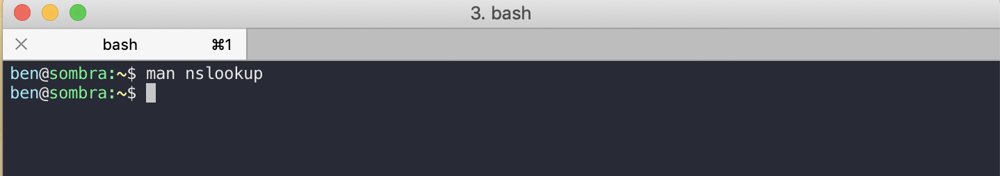
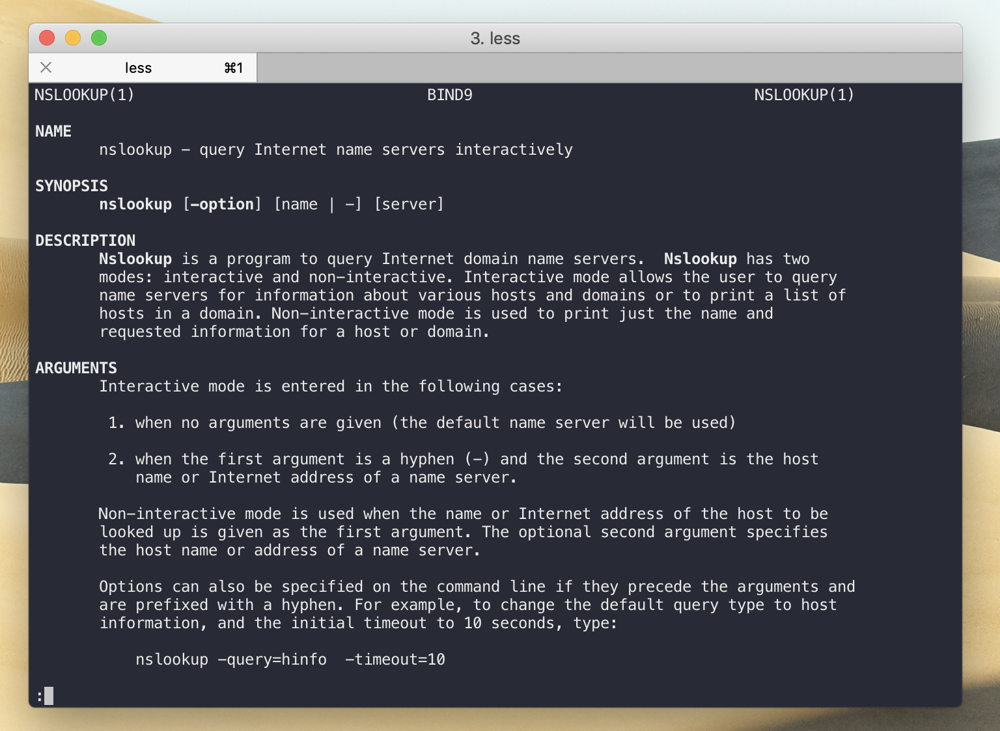

#  Intro to Bash

> Bash command, terminal command, command line command, for the purpose of our class these all mean the same things. You should already be familiar with bash from INFO 201 and INFO 340. This following section will help you refresh some of the basics.

!!! info "Huh, Bash?"
        If you feel completely lost and have never seen terminal commands we recommend watching these two videos:

        - <a href="https://www.youtube.com/watch?v=oxuRxtrO2Ag" target="_blank">Beginner's Guide to the Bash Terminal</a>
        - <a href="https://www.udacity.com/course/shell-workshop--ud206" target="_blank">Udacity Shell Workshop</a>

### Directories

* `cd` to change directories
* `ls` to show files and directories at your current path
  * `ls -a` to also show hidden files

### Editing files 

If you are editing a file on a remote server such as your Pi, you will not have the luxury of using a nice editor such as VS Code, Atom, or Sublime. Nevertheless, there are many powerful terminal editors.
Use `nano` or `vim` to edit files through your terminal.

How to edit a file that's on a linux server/your Pi:

- Use `nano <fileName>` or `vim <filename>`
- Nano is beginner friendly. 
If you are unfamiliar with these I recommend looking up a nano tutorial.

### Command documentation

If you don't know what a command does or how to use it simply use the `man` command! 
`man <commandName>` will print out an documentation. Once you're done reading hit `q` on your keyboard to quit out.  In the following screenshots I enter `man nslookup` which provides me with more information on what `nslookup` does and how it's used.





### Services: starting, stopping, status

Control services by using the `systemctl` command. The format is `sudo systemctl <action> <service name>`.

Most used 
!!! example
        Restart NGINX service: `sudo systemctl restart nginx`

### Copying Files Across Servers with *scp*

You can copy files from your laptop to a server or a server to your laptop by using `scp`. 

It uses our ssh tunnel to securely transfer your files back and forth. You can find great examples at [hyperx.org](http://www.hypexr.org/linux_scp_help.php).

Copy all of the contents of a folder:

 `:::bash scp -r  ava/*  root@157.230.163.231:/var/www/html/`

 This copies everything in the ava folder to the html folder.

### Local vs Remote

A typical confusion for students when deadling with `scp` is whether their current terminal session is doing work on their local machine (your laptop), or on a remote machine (your Raspberry Pi or another server).

You can tell which device your terminal session is doing work in by checking the hostname, that is whatever is after the `@` symbol. Take a look at the two example tabs below.

``` bash tab="Local"
# hostname = macbook-pro
# This tells me  I'm on my laptop.
ben@macbook-pro:~/Desktop/info-314/
```

``` bash tab="Remote"
# hostname = debian-lab1
# I must be on my server now.
ben@debian-lab1:~$
```

### Logs

Check a service's logs. This is a great way to see if it ran into any errors. If for some reason a service keeps crashing or behaving strangely you'd want to dig into its logs and see if it's unhappy with something.

* `:::bash sudo journcalctl -u <service name>`
* If you specifically only want to see the most recent parts of the log, you can pipe the information it gives you into the tail command, which only shows any files' ending lines. `:::bash sudo journalctl -u <service name here>.service | tail -n 100`
