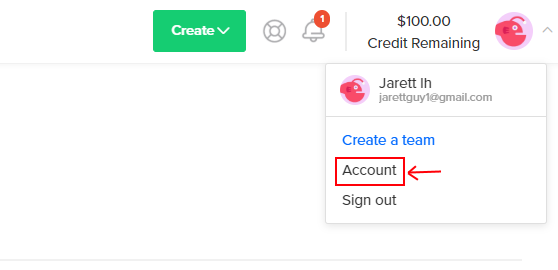
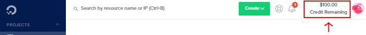

# Digital Ocean Signup

In our first lab, you will learn how to interact with a headless (no monitor, only a terminal) Linux server. We will interact with Linux a lot in this class, as your Raspberry Pi will run only as a headless Linux server.

To dive into Linux servers, we will have you use DigitalOcean, a web hosting platform, to create a virtual machine. Please follow these instructions to sign up for DigitalOcean. 

!!! warning Important
    **Please use our link to sign-up or you will not get any free credits!**

**In order to be able to complete week 1's lab, you will need to complete the following steps before class**

1. Make a new account in DigitalOcean: [Sign-up Link](<https://www.digitalocean.com/?refcode=48b2136188ce&utm_campaign=Referral_Invite&utm_medium=Referral_Program&utm_source=CopyPaste>)  
   **Please use our link to sign-up or you will not get any free credits!**  
   You can sign up with Google or GitHub if you'd like, or create new credentials, it doesn't matter
   **Note: Some students were having issues using their @uw.edu email, I would suggest using something else, like a gmail account**
   
2. Confirm your DigitalOcean account by clicking the link you are emailed after signing up

3. Next, you'll be taken to a billing page for DigitalOcean. You will need to add a credit or debit card. Don't worry, **we'll only be using free credits, you won't be charged on your card.** As long as you close your virtual machine when we email you in a few weeks, you will be fine and spend nothing. **Please don't use PayPal, because that requires you making an initial deposit of $5 in your account.**

4. Next, you'll be taken to a page to create your first project. Skip this step by clicking your user icon in the top right of the screen and selecting 'Account'

   

5. You should now see '$100.00 Credit Remaining' at the top-right of your window. If you do, you're good to go! On Tuesday (3/31), we will set up a server in DigitalOcean and introduce you to the tools that allow you to work remotely.

   