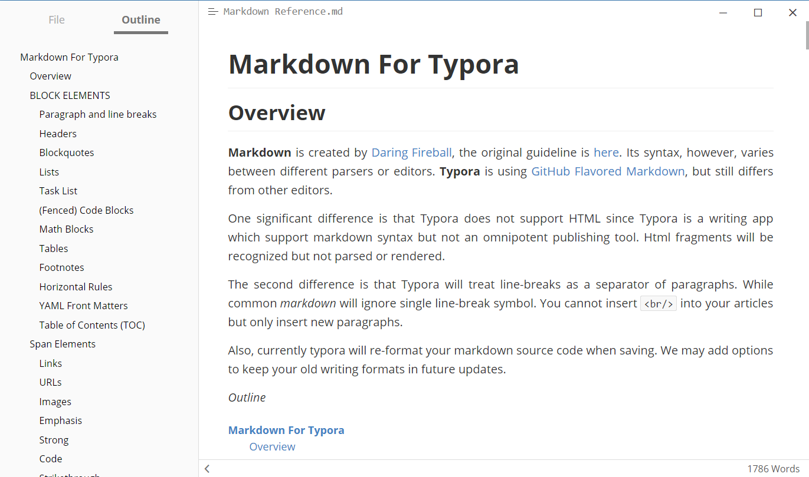

# Intro to Markdown

## What is Markdown?

"Markdown allows you to write using an easy-to-read, easy-to-write plain text format, then convert it to structurally valid XHTML (or HTML)" [source](https://readwrite.com/2012/04/17/why-you-need-to-learn-markdown/). You will be expected to use this syntax for most of your reports. Every lab you do in this course will require a lab report, and a markdown template will be provided to make your life easier. You will also find a file called `README.md` in the root of all of your GitHub repo folders that you will need to edit to describe your projects.

## How do I get started?

Don't worry if you are unfamiliar with Markdown, it's really easy to pick up. First, let's learn the syntax required to write a document in Markdown. Github has great documentation on all of the things you can do with it here: [ mastering-markdown](https://guides.github.com/features/mastering-markdown/) guide. Once you've taken a look at it, you can follow this interactive tutorial: [markdowntutorial.com](https://www.markdowntutorial.com/).

## Editors 
Now that you've got the syntax down, it's time to download and set up an editor. Most text-editing applications will work with markdown files (`.md`), but they won't allow you to preview what your document will look like with all the formatting, it will just look like `plain ##text## #with# -markdown formatting`. Instead, you should use an editor developed with markdown in mind. There are two options presented in this course.

### Option One - Standalone Editor Typora

A simple option for an editor is Typora. Typora is a simple Markdown viewer for Windows, Mac OS X, and Linux that allows you to preview and edit your Markdown document in both a source code and presentation format. You can switch between these formats with `Ctrl + /` on Windows or `Cmd + /` on Mac. You can download Typora [here](https://www.typora.io/) (download links are at the bottom of the page). 

#### Markdown -> PDF when using Typora

Often you will need to attach images to a lab report. Unless you want to upload multiple files (the markdown document, plus the images with exact names for markdown to find them) it is recommended that you compile your lab report into a PDF after completion and submit that. In Typora, you can do this by clicking `File > Export > PDF`.

### Option Two - Using VS Code

A slightly more complex option is to use Visual Studio Code. This might be the best option for you if you already use VS Code to program in other languages. To use VS Code to edit markdown documents, I recommend installing a couple extensions on VS code in order to make your life easier: `Markdown Preview Github` and `Markdown All in One`.

Each has instructions at the time of installation on how to use them.

#### Markdown -> PDF when using VS Code

Often you will need to attach images to a lab report. Unless you want to upload multiple files (the markdown document, plus the images with exact names for markdown to find them) it is recommended that you compile your lab report into a PDF after completion and submit that. If you use VS Code as a Markdown editor, you should use a command line tool such as **`grip`** to export Markdown documents to pdf.

**`grip`** is a command line tool that will easily convert your markdown file to a `pdf` or `html` file.

Installation instruction github.com/joeyespo/grip

Usage: `grip <file name>.md --export`
