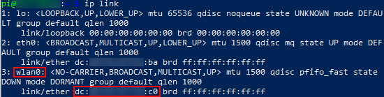
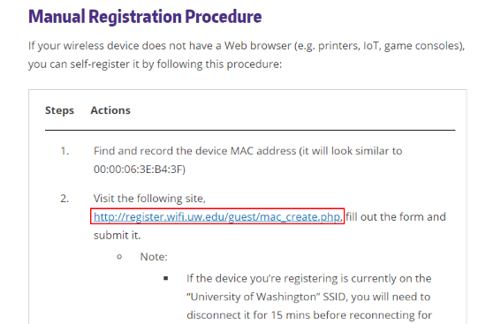
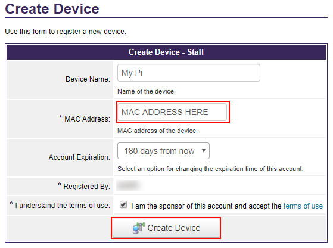
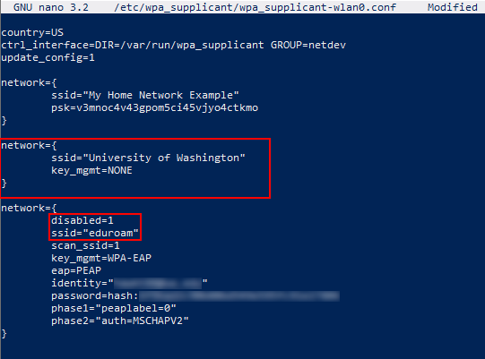

# WPA Supplicant Configuration Reference (2020-01-18)

## Basic Configuration

Wireless settings for the Pi are controlled by a service called **wpa_supplicant**, which stores information about known wireless networks in a text-based configuration file in **`/etc/wpa_supplicant/`**. By default, in Raspbian, the name of this file is **`wpa_supplicant.conf`**. You may also encounter an interface-specific configuration where the interface name is appended to the file, e.g., **`wpa_supplicant-wlan0.conf`**. In both cases, the file is owned by **root** and requires **root** privileges to read or edit.

??? danger "Security Risk"
    **`wpa_supplicant.conf`** is protected from casual reading due to the fact that it is a sensitive file that will likely contain your home network keys and a hash of your UW NetID password. While hashes typically provide some extra protection of a stored password, MD4 is nearly useless in this regard except with really strong passwords.

    Practice caution with this file:
    
    1. Never share the contents of this file directly online.
    1. Scrub passwords, keys, and hashes before committing a copy into a **repository**.
    1. Reset your password if you lose your Pi or suspect that you may have disclosed it inadvertently.

You can edit **wpa_supplicant** configs directly on the Pi using any terminal-based text editor. Alternatively, you can create the file on your local system and copy it into place on the Pi (as described later in this guide). 

??? warning "Warning: Windows line-endings and rich text format"
    As students get started with Linux networking, we frequently encounter problems related to the overall file format. As a rule, the configuration files you create in this class must be plain text with standard line endings. 
    
    You'll want to stick to using a code-oriented text editor, as opposed to options like macOS TextEdit and Windows Notepad that often save files as _rich text_ rather than plain text.
    
    For Windows users, a code-oriented editor will also help you avoid issues related to line endings. While most operating systems use a simple _New Line (aka Line Feed)_ control character to signify the end of a line, most Windows tools also include a _Carriage Return_. This alternate line ending causes parsing errors in many Linux tools.

The general structure of the configuration file is show below. The file begins with a standard set of parameters specifying the **country** (needed to initialize appropriate radio settings), a **control interface** used by network management tools, and a boolean that instructs **wpa_supplicant** to accept configuration updates from other network management tools. We won't delve any deeper into the meaning of these initial parameters within this course. Rather, our concern will be how to configure Linux to join nearby wireless networks.

!!! example "Example `wpa_supplicant.conf`"
    ```
    country=US
    ctrl_interface=DIR=/var/run/wpa_supplicant GROUP=netdev
    update_config=1

    network={
        ssid="Some public network"
        key_mgmt=NONE
    }
    
    network={
        ssid="My home network"
        psk="Don't tell anyone the password"
    }
    ```

The contents of the network block will depend largely on the security settings of the network, e.g., whether or not the network is encrypted with a passphrase. This document provides instructions for configuring three common types of networks: 

1. Unencrypted Networks
2. WPA2 Personal Networks (simple passphrase)
3. WPA2 Enterprise Networks

Let's start by examining the configuration for an unencrypted network.

##  Unencrypted Networks

All networks are defined by `parameter=value` pairs enclosed within `network={}`. Regardless of security configuration, each network block is required to contain an **`ssid`** parameter identifying the network. The **service set identifier (SSID)** is the network name that you see on your device when you connect to a wireless network. Since this name may include whitespace, we encapsulate it in double quotes.

In addition to the **ssid**, **wpa_supplicant** expects us to provide encryption a passphrase and other encryption settings for the wireless network. Omitting these settings, even for an unencrypted network, will result in errors. 

Instead, for unencrypted networks, we explicitly disable encryption with **`key_mgmt=NONE`**.

!!! example "Configuration for an unencrypted network"
    ```
    network={
        ssid="Coffee Shop"
        key_mgmt=NONE
    }
    ```

## WPA2 Personal Networks
For a basic (non-enterprise) encrypted network, the configuration of the network block changes only slightly. Rather than specify the `key_mgmt` setting, we assign the network passphrase to the `psk` parameter.

There are two ways to accomplish this task. First, we can assign the passphrase directly to the parameter in plaintext as shown here:

!!! danger "Danger: Don't do this!!!"
    ```
    network={
        ssid="Home Wifi"
        psk="super secret squirrels"
    }
    ```

Security professionals generally frown on plaintext passwords and passphrases being written to configuration files or code. As such, we prefer to write the configuration based on the raw network key (computed using a function called _PBKDF_ in conjunction with _SHA1_).

!!! faq "Using `wpa_passphrase` to generate a raw PSK"
    You can generate the raw psk directly on your Pi by running the `wpa_passphrase` utility. This utility takes your SSID as an argument and then prompts you to enter your passphrase. 

    ```bash
    # Pass your SSID as the first argument
    wpa_passphrase "Home Wifi"
    ```
    
    You will not see any characters or placeholders echoed as you type the passphrase, but **`wpa_passphrase`** will continue to accept input until you hit _Enter/Return_. The output will be a valid **wpa_supplicant** configuration that you can paste into your configuration.
    
    ```
    network={
        ssid="Home Wifi"
        psk=2508539ff867a3578f6ba7d9ee1d4a62aea82c25d30ffb1eb3a05cd08a373c02
    }
    ```

## WPA2 Enterprise Networks
Unlike home and coffee shop networks, enterprise networks like _Eduroam_, require a bit more setup since they authenticate individual users to the network as part of the process of establishing an encrypted connection. As such, these networks are substantially more secure than networks that are protected by **WPA2 Personal**. 

_Eduroam_ at UW uses the NetID system to authenticate users and grant secure access to the network. Before you can join the network, you will first need to compute a hash from your NetID password. For security and privacy purposes, you will use this hash as a substitute for your password within the final configuration.

!!! instructions "Computing an MD4 hash in Linux"
    Follow these commands in order to compute the MD4 hash in Linux.[^shellscript] The _history_ commands are not needed to compute a hash but are added for security. Without them, your password will be stored in the Bash history file and easily readable to anyone with access to your memory card.

    ```bash
    set +o history
    
    echo -n 'This is your password' | iconv -t utf16le | openssl md4
    # You should see output like 6f9bad2c90b80bd549e595fc91e27806
    
    set -o history
    ```

[^shellscript]: The project repository includes a shell script called **calc-md4-hash.sh** that will compute this value for you. It can be run from macOS, Linux, and Git Bash (Windows users). To run the script, navigate to the resources path in your git repository and type `./calc-md4-hash.sh`. You may also copy this file to your Pi and run it there.

The following template supplies all of the parameters needed to attach to Eduroam at UW. Add it to your **`wpa_supplicant.conf`**, substituting your own NetID and password hash for the supplied values.

!!! info "Eduroam configuration template"
    ```
    network={
            ssid="eduroam"
            scan_ssid=1
            key_mgmt=WPA-EAP
            eap=PEAP
            identity="YOUR_NETID@uw.edu"
            password=hash:6f9bad2c90b80bd549e595fc91e27806
            phase1="peaplabel=0"
            phase2="auth=MSCHAPV2"
    }
    ```

## Using "University of Washington" instead of "eduroam"

If eduoroam does not work for you, please let us know. **If you are given explicit instructions to connect "University of Washington" WiFi instead, then use these instructions.**

**DO NOT connect to "University of Washington" without explicit permission for us**

**Please setup your Pi for connecting to eduroam, but follow this guide if that does not work.**


To set "University of Washington" up, do as follows:


Find the MAC address of `wlan0` on your pi using the `ip link` command.

**Make sure to select the MAC of `wlan0` and not `eth0`!**




Register your `wlan0` MAC address manually for UW WiFi at:
https://itconnect.uw.edu/connect/uw-networks/campus-wi-fi/manual-wifi-reg/





Next, edit `wpa_supplicant.conf` again using:
`sudo nano /etc/wpa_supplicant/wpa_supplicant.conf`
or `sudo nano /etc/wpa_supplicant/wpa_supplicant-wlan0.conf`
depending on where you are in the setup of your Pi.

Add the “University of Washington” network.

Put this definition above `eduroam` in your `wpa_supplicant.conf` file so that it will take priority.

Also, add `disabled=1` on a line in the `eduroam` section.




## Applying Configuration Changes

Like other services, **wpa_supplicant** will not load our changes automatically. Rather than reset the daemon completely using **`systemctl`**, we can use **`wpa_cli`** to update the configuration and perform other basic maintenance.

When running **`wpa_cli`** we need to specify the interface we are configuring and a command to send to the **wpa_supplicant** service.

!!! instructions "Load configuration from `wpa_supplicant.conf`"
    ```
	# Update configuration from disk
	wpa_cli -i wlan0 reconfigure
	
	# Check the status of current connection
	wpa_cli -i wlan0 status
	```

See **`man wpa_cli`** for further instructions and examples.

